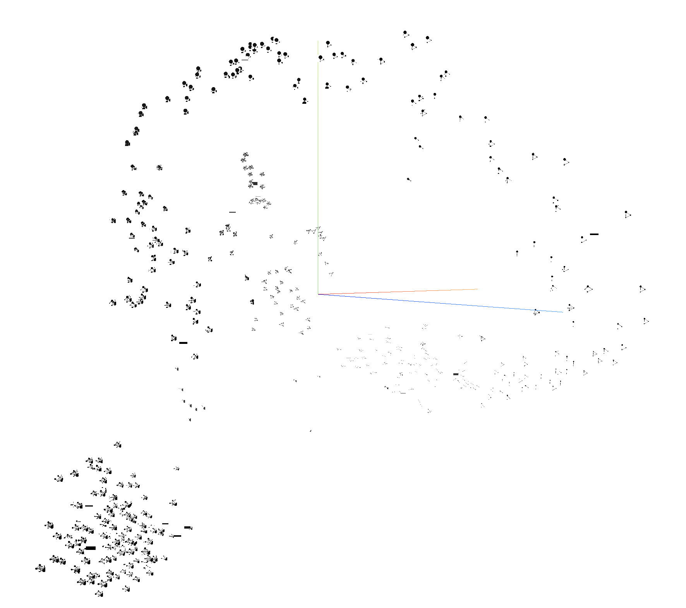
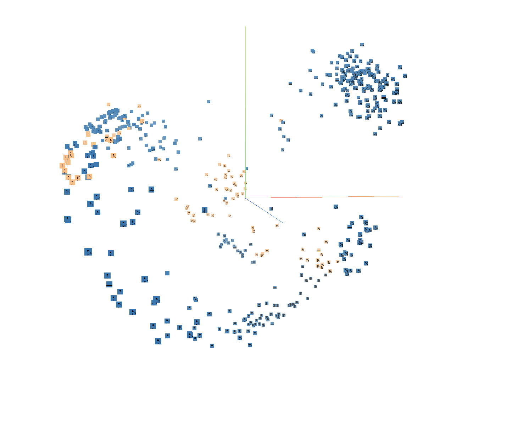

# Model Intepretation with TSNE & PCA

 This is a tutorial for [dimensionality reduction](https://en.wikipedia.org/wiki/Dimensionality_reduction) on WAF log data, and 3 kinds of visualization is provided:

 - Label & Inference visualization, yet another validation of our rule-based labelng
- CNN middle layer visualization, an intepretion of CNN-based model, inspired by the work [Understanding and Visualizing Convolutional Neural Networks](http://cs231n.github.io/understanding-cnn/) 

 ## Usage

 ### Run the script on different modes

 ```shell
python tsne_cnn.py -h
usage: tsne_cnn.py [-h] [-lr LEARNING_RATE] [-m MOMENTUM] [-b BATCH]
                   [-tb TEST_BATCH] [-e EPOCH] [-c CUDA] [-w WAY]
 Visualization for CNN model
 optional arguments:
  -h, --help            show this help message and exit
  -lr LEARNING_RATE, --learning_rate LEARNING_RATE
                        learning rate
  -m MOMENTUM, --momentum MOMENTUM
                        learning rate
  -b BATCH, --batch BATCH
                        training batch size
  -tb TEST_BATCH, --test_batch TEST_BATCH
                        test batch size
  -e EPOCH, --epoch EPOCH
                        epochs of training
  -c CUDA, --cuda CUDA  Whether use cuda
  -w WAY, --way WAY     the way of dimension reduction, "n" for selected
                        features layers, "m" for cnn middle layers
```

 ### Visualize the data by tensorboardX

 ```shell
tensorboard --logdir <dir> --port <port>
```
**<dir> : middle_run | normal_run **
 <port>: Serve diferrent dir on different port
 ## Example(How to read the visualization)
 ### Tag
The tag for each node is represented as "inference_tag_agent_method_clientip_host", eg.-1_1_Mozilla/5.0+(compatible;+AhrefsBot/5.2;++http://ahrefs.com/robot/)_GET_151.80.39.191_eetimes.com


 ### Search
You can filter out the nodes by searching at the right part of the tensorboard
## TODO
Discuss some details.
     
BIN +142 KB tsne-example/pic/black.png